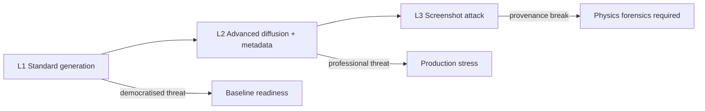

# SDB-26: Synthetic Document Benchmark for the Age of Generative AI

**Document type:** Technical white paper  
**Benchmark:** SDB-26 (The 2026 Synthetic Document Benchmark)  
**Version:** 1.0 (Public Draft)  
**Date:** April 2026  
**Author:** Ruslan Mishyn  
**License (methodology):** Creative Commons Attribution 4.0 International (CC BY 4.0)  
**Status:** Public draft — subject to revision with benchmark minor releases (1.x)

**Russian version:** [SDB26_WHITE_PAPER_RU.md](./SDB26_WHITE_PAPER_RU.md)

---

## Executive summary

Synthetic identity and documentary fraud have outpaced ad hoc vendor testing. Commercial vision models can classify high-quality AI-generated identity documents as **genuine** with **very high confidence**, while physics-aware forensic pipelines can flag the same material with high recall. The industry lacks a **standardised** way to report (1) how much synthetic fraud **bypasses** automated checks, (2) how **dangerously confident** those failures are, and (3) **which generators** expose the largest gap.

**SDB-26** is a benchmark and reporting methodology that defines:

- A **three-level** synthetic corpus (standard generation, advanced diffusion with metadata injection, and the **screenshot attack** that breaks provenance chains);
- Core metrics: **Bypass Rate (BR)**, **Confidence Gap (CG)**, **Generator Sensitivity (GS)**, and **False Positive Rate (FPR)** on a **genuine control set**;
- A **normative evaluation procedure** (production configuration, no undisclosed corpus tuning, blinding rules);
- A **machine-readable results schema** (JSON) for comparable disclosure.

This white paper explains **why** SDB-26 exists, **what** it measures, **how** evaluations should be conducted, and **how** organisations should interpret and publish results—without claiming “certification” without full, schema-compliant disclosure.

---

## 1. The problem

### 1.1 Asymmetric risk

For regulated onboarding (KYC, financial crime controls), the cost of a **false negative** on a synthetic document is not symmetric with a random classification error: a missed synthetic document may represent **material fraud** or **regulatory breach**, while tuning only for “accuracy” on balanced sets can hide catastrophic bypass.

### 1.2 Confidence as a second-order failure mode

A system that returns **“genuine” at 97% confidence** on a synthetic document does more harm than one that returns **“suspicious” at 52% confidence**: the former **disarms** human review and downstream automation. Any serious benchmark must therefore capture not only **whether** fraud passed, but **how confidently** it passed.

### 1.3 Generator heterogeneity

Fraud actors migrate to the **weakest** tool against a given stack. Aggregate accuracy obscures **which** generator (which pipeline, which post-processing) drives bypass. **Generator Sensitivity** makes that exposure explicit.

### 1.4 The provenance blind spot (Level 3)

Content authenticity standards (e.g. **C2PA**) attach provenance to a **file at creation**. A **screenshot** or **photo of a screen** produces a **new** file: provenance is not merely broken—it is **absent** in the sense relevant to file-level cryptography. Defences that depend on metadata, signatures, or AI watermarks in the **original** synthetic file fail by design against a well-executed **screenshot attack**. SDB-26 treats Level 3 as the **structural** threat class and expects evaluators to measure it explicitly—using **physics-based** and **compression-aware** forensics, not provenance alone.

---

## 2. Scope and definitions

### 2.1 What SDB-26 evaluates

Per the normative standard, SDB-26 applies to systems that accept **documentary evidence** as input, including:

- Identity document verification (KYC);
- Document authenticity verification in financial services;
- Comparable evidence submission workflows.

### 2.2 What SDB-26 does not evaluate

SDB-26 **does not** evaluate biometric liveness, sanctions/PEP screening, or transaction monitoring. Those are orthogonal controls with their own standards.

### 2.3 Core definitions (summary)

| Term | Meaning |
|------|---------|
| **Synthetic document** | Document imagery produced by generative AI (diffusion, GANs, multimodal models), with or without post-processing. |
| **Screenshot attack** | Capture of a synthetic document via screen photography or capture, stripping prior provenance and many AI markers while preserving usable fraud utility. |
| **Bypass Rate (BR)** | Share of synthetic documents receiving an outcome equivalent to **approval as genuine**. |
| **Confidence Gap (CG)** | Mean confidence on **incorrect approvals** of synthetic documents (how “dangerously wrong” the system is). |
| **Generator Sensitivity (GS)** | BR restricted to each generator or pipeline represented in the corpus. |
| **False Positive Rate (FPR)** | Share of **genuine** documents incorrectly flagged as synthetic (or denied) under the evaluation mapping. |

Full formal definitions appear in **STANDARD.md** (SDB-26 v1.0).

---

## 3. The three-level threat model

SDB-26 organises synthetic complexity into **three levels**—not as a marketing ladder, but as a mapping to **operational** threat classes.

### Level 1 — Standard generation

Represents **democratised** fraud: widely available general-purpose generators, minimal post-processing, minimum resolution constraints. If a system cannot control Level 1 at acceptable BR/FPR trade-offs, it is not credible for production document screening.

### Level 2 — Advanced diffusion

Represents **professional** fraud: fine-tuned pipelines, specialised tooling, **metadata injection** (plausible EXIF, device fields). This is where many purely vision or naive metadata approaches begin to fail.

### Level 3 — Screenshot attack

Represents **structural** evasion of provenance: the submitted file is “real” in the sense that a phone camera produced it—but the **scene** is synthetic. Level 3 is where **C2PA and similar file-creation provenance** do not transfer. Evaluation here focuses on **intrinsic** signals (frequency domain, repeated compression, moiré-related structure where applicable, sensor/plausibility inconsistencies, etc.), as discussed in the measurement methodology companion.



---

## 4. Metrics: why BR alone is insufficient

### 4.1 Bypass Rate (BR)

BR isolates the compliance-relevant question for synthetic ground truth:

\[
\mathrm{BR} = \frac{\mathrm{FN}}{\mathrm{FN} + \mathrm{TP}} \times 100
\]

where FN/TP are defined against synthetic documents and an operational mapping of “approved as genuine.”

**Reporting requirement:** BR must be disclosed **per level**, **per document type**, **per generator**, and as an overall summary where applicable.

### 4.2 Confidence Gap (CG)

CG captures the **quality of failure**: mean confidence on incorrect approvals (with standard deviation in reporting). If BR = 0, CG is **not applicable** (no incorrect approvals at that slice).

### 4.3 Generator Sensitivity (GS)

GS is BR **restricted** to each generator bucket. It answers: “Which tool does this stack silently approve?”

### 4.4 False Positive Rate (FPR)

SDB-26 **requires** a genuine control set and FPR reporting alongside BR. A system may not be “optimised” for publication by crushing BR while exploding denials on legitimate customers—such a system is **not compliant** with SDB-26 reporting standards even if BR looks attractive.

---

## 5. Corpus integrity and evaluation discipline

### 5.1 Corpus integrity

The normative standard requires:

- Unique identifiers per document;
- SHA-256 hashes recorded at corpus creation;
- Ground truth labels stored separately from raw files;
- Corpus version recorded with each evaluation.

### 5.2 Evaluation procedure (high level)

1. **System configuration:** evaluate the **production** configuration; any deviation must be disclosed.  
2. **Submission:** submit documents exactly as production clients would; no undisclosed pre-processing.  
3. **Collection:** store verdict, confidence, processing time, and raw response where needed for audit.  
4. **Blinding:** do not train or fine-tune on benchmark documents prior to evaluation without disclosure.

### 5.3 Verdict mapping

Real systems return heterogeneous labels (`suspicious`, `insufficient quality`, vendor-specific enums). SDB-26 evaluations must publish an explicit mapping from **system verdicts** to the benchmark’s **evaluation categories** for TP/FN/FP/TN assignment—especially for borderline classes such as **suspicious** (often counted as non-bypass if it triggers manual review rather than auto-approval).

---

## 6. Reporting and governance

### 6.1 JSON schema

Published results should validate against the **SDB-26 results JSON schema** (`results_schema.json`), including:

- Benchmark and corpus versions;
- System under test (name, version, mode);
- Evaluation date and evaluator type (`self` vs `third_party`);
- Per-level results and FPR object;
- Generator sensitivity table.

### 6.2 Publication rules (anti-washing)

Organisations must not:

- Claim “SDB-26 certified” without publishing full, schema-compliant results;
- Selectively omit tested levels;
- Publish modified corpus results as SDB-26 compliant.

### 6.3 Versioning

Within **major version 1.x**, minor corpus extensions remain comparable at the methodology level; **major version 2.0** would denote breaking changes to metric definitions—cross-major comparisons must be reported separately.

---

## 7. Relation to regulatory context (informative)

Synthetic document fraud intersects customer due diligence obligations in multiple jurisdictions. SDB-26 was developed alongside technical commentary proposing **forensic image physics analysis** as a mandatory verification layer in modern CDD/AML technical standards—because provenance-only approaches are **insufficient** against Level 3. This white paper does not provide legal advice; it frames **why** measurement must include intrinsic forensics, not only vision classification or metadata.

---

## 8. Illustrative baseline (not a substitute for your own evaluation)

Public draft materials include illustrative comparisons between a **vision-model baseline** and a **forensic pipeline** on early corpus slices. Organisations must run their **own** evaluations on the **authorised corpus version** and disclose configuration. Early published examples show high bypass on synthetic passports for naive vision baselines and low bypass for a forensic configuration on tested slices—**Level 3 and full genuine-control FPR** may remain **pending** until the complete corpus slices are finalised and published under the benchmark’s release policy.

Treat any numbers in marketing summaries as **illustrative** unless tied to a specific, schema-valid JSON results file, corpus version, and evaluator type.

---

## 9. Roadmap and ecosystem goals

Near-term benchmark goals typically include:

- Completing **Level 3** corpus slices and reporting **L3 BR/CG** under standard conditions;
- Completing **genuine control** evaluations and reporting **FPR** alongside BR;
- Expanding **generator coverage** in minor releases (1.x) while keeping metrics comparable;
- Encouraging **third-party** evaluations to reduce self-assessment bias.

Long-term governance aims include independent stewardship once multiple organisations publish under the same rules.

---

## 10. How to participate

- **Read** the normative **STANDARD.md** and the companion **METHODOLOGY.md**.  
- **Request corpus access** under the benchmark’s distribution terms (the corpus itself is not CC-licensed in the same way as the methodology text).  
- **Publish** schema-compliant JSON and disclose evaluator type and corpus version.  
- **Contribute** improvements via the benchmark’s public issue tracker or documented contribution channels.

**Contact:** sevrusik@gmail.com

---

## 11. Citation

Suggested citation:

```
Mishyn, R. (2026). SDB-26: The 2026 Synthetic Document Benchmark.
Methodology and standard (Public Draft v1.0).
```

---

## Disclaimer

This white paper summarises and interprets the SDB-26 public draft. In case of conflict, the **normative STANDARD.md** and the **results JSON schema** in the benchmark repository prevail. Nothing herein constitutes legal, regulatory, or product certification.

---

*End of white paper.*
