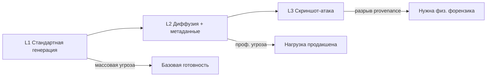

# SDB-26: синтетический документальный бенчмарк в эпоху генеративного ИИ

**Тип документа:** технический white paper  
**Бенчмарк:** SDB-26 (The 2026 Synthetic Document Benchmark)  
**Версия:** 1.0 (публичный черновик)  
**Дата:** апрель 2026  
**Автор:** Ruslan Mishyn  
**Лицензия (методология):** Creative Commons Attribution 4.0 International (CC BY 4.0)  
**Статус:** публичный черновик — может обновляться при минорных релизах бенчмарка (1.x)

**Англоязычная версия:** [SDB26_WHITE_PAPER.md](./SDB26_WHITE_PAPER.md)

---

## Резюме для руководства

Синтетическая идентификационная и документальная фрауд-модель развивается быстрее разрозненных vendor-тестов. Коммерческие vision-модели могут классифицировать высококачественные AI-паспорта как **подлинные** с **очень высокой уверенностью**, тогда как конвейеры, учитывающие физику сенсора и компрессии, часто находят те же сэмплы с высокой полнотой (recall). Отрасли не хватает **стандартизированного** способа публиковать: (1) какая доля синтетики **проходит** автоматические проверки как «гenuine», (2) насколько **опасно уверенно** система ошибается при этом, (3) **какие генераторы** дают максимальный зазор.

**SDB-26** — это бенчмарк и методология отчётности, которые задают:

- **Трёхуровневый** синтетический корпус (стандартная генерация, продвинутая диффузия с инъекцией метаданных, **атака скриншотом**, разрывающая цепочки происхождения);
- Ключевые метрики: **Bypass Rate (BR)**, **Confidence Gap (CG)**, **Generator Sensitivity (GS)** и **False Positive Rate (FPR)** на **контрольном наборе подлинных документов**;
- **Нормативную процедуру оценки** (продакшен-конфигурация, без недекларированной подгонки под корпус, правила blinding);
- **Машиночитаемую схему результатов** (JSON) для сопоставимого раскрытия данных.

Этот white paper объясняет **зачем** нужен SDB-26, **что** он измеряет, **как** проводить оценку и **как** интерпретировать и публиковать результаты — без заявлений о «сертификации» без полного соответствия схеме и публикации.

---

## 1. Проблема

### 1.1 Асимметрия риска

В регулируемом онбординге (KYC, финансовый мониторинг) цена **ложноотрицательного** решения по синтетическому документу не симметрична случайной ошибке классификации: пропущенная синтетика — это **фрод** или **регуляторный разрыв**, а подгонка только под «accuracy» на сбалансированной выборке может скрыть катастрофический bypass.

### 1.2 Уверенность как второй порог отказа

Система, которая на синтетике возвращает **«genuine» с уверенностью 97%**, вредит сильнее, чем система с **«suspicious» и 52%**: первая **обезоруживает** ручной разбор и downstream-автоматизацию. Серьёзный бенчмарк должен фиксировать не только **прошёл** ли фрод, но и **насколько уверенно** его пропустили.

### 1.3 Гетерогенность генераторов

Злоумышленники переходят на **самый слабый** для вашего стека инструмент. Средняя accuracy маскирует вопрос: **какой** генератор (какой пайплайн, какой постпроцесс) даёт bypass. **Generator Sensitivity** делает этот риск явным.

### 1.4 Слепая зона происхождения (уровень 3)

Стандарты подлинности контента (например, **C2PA**) привязывают происхождение к **файлу в момент создания**. **Скриншот** или **фото экрана** порождает **новый** файл: происхождение не просто «сломано» — оно **отсутствует** в смысле, релевантном для криптографии на уровне файла. Защита, опирающаяся на метаданные, подписи или AI-маркеры **исходного** синтетического файла, по замыслу атакующего **не срабатывает** против аккуратной **screenshot attack**. SDB-26 относит уровень 3 к **структурному** классу угроз и ожидает явного измерения — через **физику изображения**, анализ компрессии и частотную область, а не только provenance.

---

## 2. Область применения и определения

### 2.1 Что оценивает SDB-26

Согласно нормативному стандарту, SDB-26 применим к системам, принимающим на вход **документальные доказательства**, в том числе:

- верификация удостоверений (KYC);
- проверка подлинности документов в финансовых сервисах;
- сопоставимые процессы подачи доказательств.

### 2.2 Что SDB-26 не оценивает

SDB-26 **не** оценивает биометрический liveness, санкционные/PEP-проверки или мониторинг транзакций. Это ортогональные контуры со своими стандартами.

### 2.3 Ключевые определения (кратко)

| Термин | Смысл |
|--------|--------|
| **Synthetic document** | Изображение документа, полученное генеративным ИИ (диффузия, GAN, мультимодальные модели), с постобработкой или без. |
| **Screenshot attack** | Захват синтетического документа с экрана (фото/скриншот), с удалением прежнего происхождения и многих AI-маркеров при сохранении мошеннической ценности файла. |
| **Bypass Rate (BR)** | Доля синтетических документов с исходом, эквивалентным **одобрению как подлинного**. |
| **Confidence Gap (CG)** | Средняя уверенность по **ошибочным одобрениям** синтетики (насколько «опасно уверенно» ошибается система). |
| **Generator Sensitivity (GS)** | BR, посчитанный **отдельно** по каждому генератору/пайплайну в корпусе. |
| **False Positive Rate (FPR)** | Доля **подлинных** документов, ошибочно помеченных как синтетика (или отклонённых) в рамках принятого маппинга вердиктов. |

Полные формальные определения — в **STANDARD.md** (SDB-26 v1.0).

---

## 3. Трёхуровневая модель угроз

SDB-26 упорядочивает сложность синтетики в **три уровня** — не как маркетинговую лестницу, а как соответствие **операционным** классам угроз.

### Уровень 1 — стандартная генерация

**Демократизированный** фрод: массовые генераторы, минимум постобработки, ограничения по разрешению. Если на уровне 1 нельзя удержать приемлемый компромисс BR/FPR, система **не кредибельна** для продакшен-скрининга документов.

### Уровень 2 — продвинутая диффузия

**Профессиональный** фрод: fine-tune, специализированные инструменты, **инъекция метаданных** (правдоподобный EXIF, поля устройства). Здесь чаще всего начинают сыпаться чисто vision-подходы и наивная работа только с метаданными.

### Уровень 3 — атака скриншотом

**Структурный** обход provenance: файл «настоящий» в том смысле, что его снял телефон, но **сцена** — синтетическая. Для уровня 3 **C2PA и аналоги на уровне создания файла не переносятся**. Оценка опирается на **интриnsic**-сигналы (частотная область, повторная компрессия, при необходимости структуры, связанные с муаром/сеткой экрана, несогласованности сенсора и т.д.) — см. сопутствующий **METHODOLOGY.md**.



---

## 4. Метрики: почему одного BR мало

### 4.1 Bypass Rate (BR)

BR изолирует вопрос, релевантный для compliance, на синтетическом ground truth:

\[
\mathrm{BR} = \frac{\mathrm{FN}}{\mathrm{FN} + \mathrm{TP}} \times 100
\]

где FN/TP задаются относительно синтетики и операционного маппинга «одобрено как подлинное».

**Требования к отчёту:** BR — **по уровням**, **по типу документа**, **по генератору**, плюс сводка там, где применимо.

### 4.2 Confidence Gap (CG)

CG описывает **качество ошибки**: средняя уверенность на ошибочных одобрениях (в отчёте — со стандартным отклонением). Если BR = 0, CG **не применим** (нет ошибочных одобрений на срезе).

### 4.3 Generator Sensitivity (GS)

GS — это BR **внутри одного** bucket генератора. Ответ на вопрос: «какой инструмент этот стек молча одобряет?»

### 4.4 False Positive Rate (FPR)

SDB-26 **требует** контрольный набор подлинных документов и публикацию **FPR рядом с BR**. Нельзя «оптимизировать» публичный отчёт, вдавив BR ценой взрыва отказов честным клиентам — такая конфигурация **не соответствует** правилам отчётности SDB-26, даже если BR выглядит красиво.

---

## 5. Целостность корпуса и дисциплина оценки

### 5.1 Целостность корпуса

Нормативный стандарт требует:

- уникальный идентификатор каждого документа;
- фиксацию SHA-256 при создании корпуса;
- хранение меток ground truth отдельно от файлов;
- указание версии корпуса в каждой оценке.

### 5.2 Процедура оценки (в общих чертах)

1. **Конфигурация системы:** оценивать **продакшен**-конфигурацию; любые отклонения — раскрывать.  
2. **Подача:** как в проде; без недекларированного препроцессинга.  
3. **Сбор:** вердикт, уверенность, время обработки, при необходимости сырой ответ для аудита.  
4. **Blinding:** не обучать и не дообучать на документах бенчмарка до оценки без раскрытия факта.

### 5.3 Маппинг вердиктов

Реальные системы возвращают разные метки (`suspicious`, `insufficient quality`, vendor-specific enum). В оценке SDB-26 нужно **опубликовать явный маппинг** вердиктов системы на **категории бенчмарка** для TP/FN/FP/TN — особенно для **suspicious** (часто считается non-bypass, если инициируется ручной разбор, а не авто-одобрение).

---

## 6. Отчётность и управление

### 6.1 JSON-схема

Публикуемые результаты должны проходить валидацию по **SDB-26 results JSON schema** (`results_schema.json`), в том числе:

- версии бенчмарка и корпуса;
- система под оценкой (имя, версия, режим);
- дата оценки и тип оценщика (`self` / `third_party`);
- результаты по уровням и объект FPR;
- таблица generator sensitivity.

### 6.2 Правила публикации (anti-washing)

Организациям **нельзя**:

- заявлять «SDB-26 certified» без полной публикации результатов, соответствующих схеме;
- выборочно скрывать протестированные уровни;
- выдавать результаты по изменённому корпусу как «SDB-26 compliant».

### 6.3 Версионирование

В рамках **мажорной версии 1.x** минорные расширения корпуса остаются сопоставимыми на уровне методологии; **мажор 2.0** означал бы смену определений метрик — сравнение между мажорами нужно вести **раздельно**.

---

## 7. Связь с регуляторным контекстом (информационно)

Синтетический документный фрод пересекается с обязанностями по должной осмотрительности (CDD) в разных юрисдикциях. SDB-26 разрабатывался параллельно с техническими комментариями к стандартам CDD/AML, предлагающими **обязательный слой форензики изображения (физика)** — потому что одного provenance на уровне 3 **недостаточно**. Этот white paper **не является** юридической консультацией; он задаёт рамку **почему** измерения должны включать интриnsic, а не только vision-классификацию или метаданные.

---

## 8. Иллюстративный baseline (не замена вашей оценке)

В материалах черновика есть иллюстративные сравнения **vision-бейзлайна** и **форензик-конвейера** на ранних срезах корпуса. Организации обязаны проводить **собственные** прогоны на **авторизованной версии корпуса** и раскрывать конфигурацию. Ранние примеры показывают высокий bypass для наивного vision на синтетических паспортах и низкий bypass для форензик-конфигурации на протестированных срезах — **уровень 3 и полный FPR на подлинных** могут оставаться **pending** до финализации соответствующих срезов корпуса и политики публикации бенчмарка.

Любые цифры в маркетинговых сводках считать **иллюстративными**, пока они не привязаны к конкретному JSON-файлу результатов, валидному по схеме, с версией корпуса и типом оценщика.

---

## 9. Дорожная карта и цели экосистемы

Типичные ближайшие цели бенчмарка:

- завершить срезы **уровня 3** и публиковать **L3 BR/CG** в стандартных условиях;
- завершить оценку на **контроле подлинных** и публиковать **FPR** рядом с BR;
- расширять **покрытие генераторов** в минорных релизах (1.x) с сохранением сопоставимости метрик;
- стимулировать **независимые (third-party)** оценки, чтобы снизить смещение самооценки.

Долгосрочная цель управления — независимое stewardship после публикации результатов несколькими организациями по единым правилам.

---

## 10. Как участвовать

- **Изучить** нормативный **STANDARD.md** и **METHODOLOGY.md**.  
- **Запросить доступ к корпусу** на условиях распространения бенчмарка (сам корпус не распространяется под той же CC, что текст методологии).  
- **Публиковать** JSON, соответствующий схеме, с указанием типа оценщика и версии корпуса.  
- **Вносить улучшения** через публичный трекер задач бенчмарка или задокументированные каналы контрибуции.

**Контакт:** sevrusik@gmail.com

---

## 11. Цитирование

Рекомендуемое цитирование:

```
Mishyn, R. (2026). SDB-26: The 2026 Synthetic Document Benchmark.
Methodology and standard (Public Draft v1.0).
```

---

## Отказ от ответственности

Этот white paper обобщает и интерпретирует публичный черновик SDB-26. При расхождении приоритет имеют **STANDARD.md** и **JSON-схема результатов** в репозитории бенчмарка. Документ **не** является юридической, регуляторной или продуктовой сертификацией.

---

*Конец white paper.*
